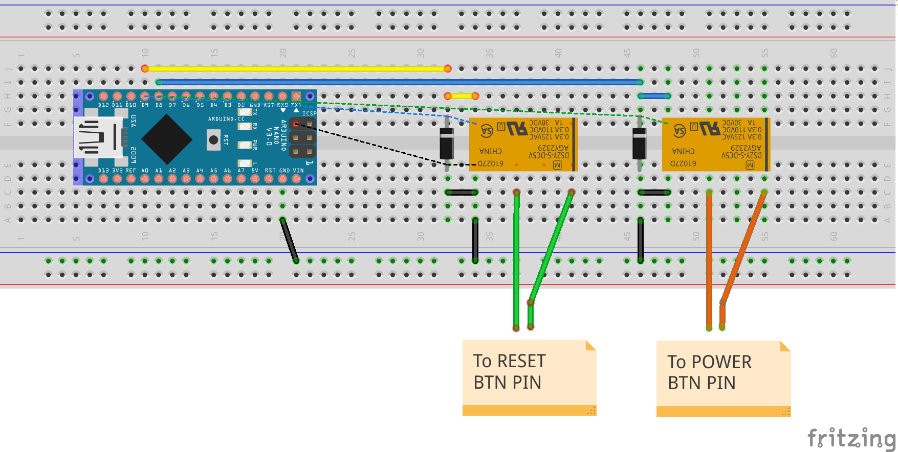

# arduino_pc_reset
This project is about making Arduino usb key for manipulating PC's reset/power buttons.

- This tiny circuit makes it possible to do hardware resetting by pc itself.
- This comes quite handy when you need to recover from hardware error that no software reset recovers. (ex. PCIe link error, GPU hangs)
- By adding a single line of code to your shell script, you will be able to hardware reset auto matically. (or just power off)

## Layout
  

## pin out

 | Pin     | Direction  | Purpose |
 | ------- |:----------:| -------:|
 | D9      | OUTPUT     | RESET   |
 | D8      | OUTPUT     | POWER   |

## protocol

- All commands/responses are in text
- Each command ends with either ';' or <LF>
- Serial speed is fixed to 9600bps

### commands

- ? ...  show help"
- set RESET=1 ...  reset on
- set RESET=0 ...  reset off
- set RESET=* ...  reset on for 1 sec
- set POWER=1 ...  power on");
- set POWER=0 ...  power off");
- set POWER=* ...  power on for 10 sec

'*' is not a wild card. you send it as is.

### response

- OK ... your command succeeded.
- NG ... something went wrong.
